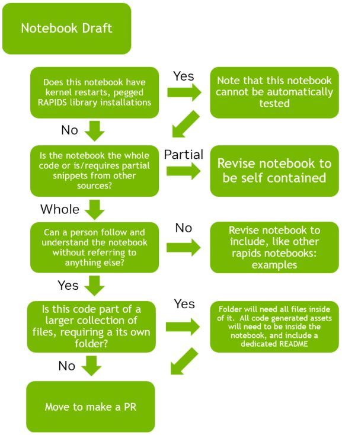

# Contributing to Notebooks Showcase
## Overview

Thanks for wanting to contribute to the RAPIDS Community Showcase.  As you may know, the expected notebooks found here are those that showcase, for NVIDIA RAPIDS libraries:

- New Features
- Useful and relevant tutorials
- Highly impactful "best practices" walkthroughs.

Examples of the types of notebooks that go here are notebooks supporting blog posts or conferences, which should be kept up to date for a couple of releases. There is an expectation of maintentance support by you, the contributor. 

Ways to contribute to the `rapidsai-community/showcase` repo fall into the following 3 categories:

  **1. I found a Bug in an existing Notebook or Propose a New Notebook/Tutorial/Walkthrough** (Can be done by any RAPIDS Community Member)

  **2. I want to Implement a bug fix or satisfy a feature request** (Only done by Notebook Maintainers)

  **3. I want to Propose and create a new notebook/tutorial/walk through** (Only done by RAPIDS Team Members and NVIDIA Employees) 

For #1, please look at the [Creating an Issue](creating-an-issue) section, which you should do before doing #2 and #3.

For #2 and #3, please look at the [Code Contributions](#code-contributions) section.

## Creating an Issue

Sometimes things unexpectedly break in our notebooks.  Sometimes you see an opportunity to share an example or workflow with the world.  This section is for everyone who uses Showcase and your help is greatly appreciated!

### Filing a Bug
- File an [issue](https://github.com/rapidsai-community/showcase/issues/new/choose)
describing what you encountered or what you want to see changed
- The RAPIDS team will evaluate the issues and triage them, scheduling
them for a release
    - If you believe the issue needs priority attention, please
comment on the issue to notify the team.

### Proposing a New Notebook/Tutorial/Walkthrough
To propose and implement a new notebook, please file a new feature request [issue](https://github.com/rapidsai-community/showcase/issues/new/choose)
- Describe the intended feature and discuss the design & implementation with the community
- Once the team agrees that the plan looks good, implement it using the [code contributions](#code-contributions) guide below
- Test your notebook using our [testing guide](TESTING.md)!

## Code Contributions
In Showcase, Code Contributions are only for members of the RAPIDS team or NVIDIA employees.  If you are not part of NVIDIA, don't worry, that's what [Notebooks Contrib](https://github.com/rapidsai-community/notebooks-contrib) is for!  Please contribute your Notebook there, [following this guide](https://github.com/rapidsai-community/notebooks-contrib?tab=readme-ov-file#contributing). In both cases, your help is appreciated!


### Getting Started with Contributing to Showcase

1. Fork the repository on GitHub.
2. Clone your fork locally:
```bash
git clone https://github.com/rapidsai-community/showcase.git
```
3. navigate into the Showcase folder
```bash
cd showcase
```
4. Create a branch for your changes:
```bash
git checkout -b my-new-feature-branch
```

### Code and Content Standards

#### Requirements When Creating a Notebook

**Starting Considerations**
- The Notebook must be complete code that will stand on it's own. Please, no code snippets or code gaps in the flow of work neccessary to execute the notebook.  This includes any out of notebook work, like getting datasets, environment variables, library installation, and other necessary code/commands. 
- The Notebook must have prose to help situate a person.  Write as if for a student or novice.  Provide links to clarifying sources if necessary.  For Example:
   - [Example Notebook 1](https://github.com/rapidsai/cuml/blob/branch-25.10/notebooks/arima_demo.ipynb) - Standard
   - [Example Notebook 2](https://github.com/rapidsai/cugraph/blob/branch-25.10/notebooks/algorithms/community/Louvain.ipynb) – In depth

- RAPIDS Showcase Notebooks can be targeted to run in one of 3 places.  Please let us know which place you want them to run as part of your submission:
  1. `Colab Based` – Made to run on Google Colab
  1. `RAPIDS Stable Based` – Made to Run on RAPIDS Stable.
  1. `Pegged Version Based` – Made to run on a specific version of RAPIDS (e.g., specific nightlies version 25.10)

**Other Considerations**
- If the notebook requires other files (eg: *.py, *.sh, data files, etc), please put the notebook and all associated files in its own folder, which will be a subfolder of its home folder.  The folder will also require a README.md file which will outline the files and explain how to use them together.
- If creating a notebook that can be tested during release, 
  - Only `RAPIDS Stable Based` notebooks will be routinely tested.
  - in order to be testable, the notebook cannot make breaking changes to the RAPIDS install or the docker container (no pinned RAPIDS versions or supporting libraries)
- Please do not add forced restarts, such as `get_ipython().kernel.do_shutdown(restart=True)`, even for Colab Notebooks.  We have an alternate way to reset libraries for zero code change examples.
- If you would like to have some internal benchmarks within your code, please add the `%%time` and `%%timeit` magic commands for each cell with a function that you want to time.

Please refer to the Flow Chart below to further guide your thought process:



### Submitting Your Contribution

1. Commit your changes with a descriptive message.  Here is an example:
```bash
git commit -m "added a great and useful contribution"
```

2. Push the commit to your fork:
```bash
git push origin my-new-feature-branch
```

3. Create a Pull Request from your fork to the main repository.
4. Fill out the PR template with details about your changes.

## Review Process
- A maintainer will review your PR and may suggest changes.  Due to the high standard in notebook quality, please be prepared to do some iterations.
- Once approved, your PR will be merged.
- Your contribution will then be visible in RAPIDS Showcase!  Congratulations

## Maintenance and Lifecycle
### Maintenance Expectations
If you put a notebook in RAPIDS Showcase, you are expected to support that notebook for as long as it is in the repository.  If there is a change, like an API change, that causes your notebook to fail, you are responsible to fix:
1. An issue will be made and you will be tagged
1. After 1 week, a reminder will be sent (including PIC)
1. By next release or 1 month, whichever is longer, notebooks will be assumed no longer maintained and your PIC will be informed to move the notebook into it's next stage in the Lifecycle.

### Next Stage in the Lifecycle
As Showcase Notebooks have a short Active Lifespan, notebooks that are no longer being maintained/, will be moved into rapidsai-community/notebooks-contrib (see below) or into a Brev Launchable Instance.

Please reach out to us, if you are no longer able to Maintain your notebook or think i's time to transition it.  Outside of that the RAPIDS Community team will reach out to you.

Thank you again for your contribution!
